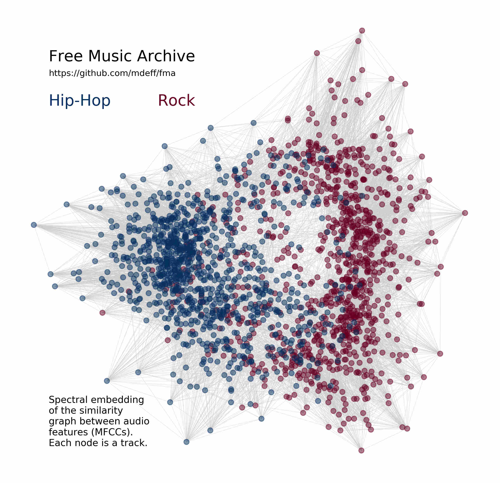

# crowdai-musical-genre-recognition-starter-kit

Starter kit for the [WWW2018] challenge "[Learning to Recognize Musical Genre][challenge]" hosted on CrowdAI.

[www2018]: https://www2018.thewebconf.org
[challenge]: https://www.crowdai.org/challenges/www-2018-challenge-learning-to-recognize-musical-genre



The data used for this challenge comes from the [FMA dataset][fma_repo]. You
are encouraged to check out that repository for Jupyter notebooks showing how
to use the data, exploring it, and training baseline models. This challenge
uses the `rc1` version of the data, make sure to checkout that version of the
code. The associated [paper][fma_paper] describes the data.

[fma_repo]: https://github.com/mdeff/fma
[fma_paper]: https://arxiv.org/abs/1612.01840

## Installation

[datasets]: https://www.crowdai.org/challenges/www-2018-challenge-learning-to-recognize-musical-genre/dataset_files

Download and extract [datasets] such as:
* Training metadata `csv` files from `fma_metadata.zip` are accessible at `data/fma_metadata/*.csv`.
* Training `mp3` files from `fma_medium.zip` are accessible at `data/fma_medium/*/*.mp3`.
* Test `mp3` files from `fma_crowdai_www2018_test.tar.gz` are accessible at `data/crowdai_fma_test/*.mp3`.

```sh
git clone https://github.com/crowdAI/crowdai-musical-genre-recognition-starter-kit
cd crowdai-musical-genre-recognition-starter-kit
pip install -r requirements.txt
```

**NOTE**: This challenge requires `crowdai` version 1.0.14 at least.
The code in this repository and the [FMA repository][fma_repo] has been tested with Python 3.6 only.

## Usage

Run `python convert.py` to convert `data/fma_metadata/tracks.csv` to a simpler
`data/train_labels.csv` file where the first column is the `track_id` and the
second column is the target musical genre.

You can now load the training labels with:
```python
import pandas as pd
labels = pd.read_csv('data/train_labels.csv', index_col=0)
```

The path to the training mp3 with a `track_id` of 2 is given by:
```python
import fma
path = fma.get_audio_path(2)
```
and can be loaded as a numpy array with:
```python
import librosa
x, sr = librosa.load(path, sr=None, mono=False)
```

The list of testing file IDs can be obtained with:
```python
import glob
test_ids = sorted(glob.glob('data/crowdai_fma_test/*.mp3'))
test_ids = [path.split('/')[-1][:-4] for path in test_ids]
```
and the path to a testing mp3 is given by:
```python
path = 'data/crowdai_fma_test/{}.mp3'.format(test_ids[0])
```

The submission file can be created with:
```python
CLASSES = ['Blues', 'Classical', 'Country', 'Easy Listening', 'Electronic',
           'Experimental', 'Folk', 'Hip-Hop', 'Instrumental', 'International',
           'Jazz', 'Old-Time / Historic', 'Pop', 'Rock', 'Soul-RnB', 'Spoken']

submission = pd.DataFrame(1/16, pd.Index(test_ids, name='file_id'), CLASSES)
submission.to_csv('data/submission.csv', header=True)
```
and then submitted with:
```python
import crowdai
API_KEY = '<your_crowdai_api_key_here>'
challenge = crowdai.Challenge('WWWMusicalGenreRecognitionChallenge', API_KEY)
response = challenge.submit('data/submission.csv')
print(response['message'])
```

## Examples

See the [random_submission.py](random_submission.py) script for a complete
submission example, to be run as:
```
python random_submission.py --api_key=<YOUR CROWDAI API KEY>
```

## Authors

* S.P. Mohanty, <sharada.mohanty@epfl.ch>
* Michaël Defferrard, <michael.defferrard@epfl.ch>

The code in this repository is released under the terms of the
[MIT license](LICENSE.txt).
